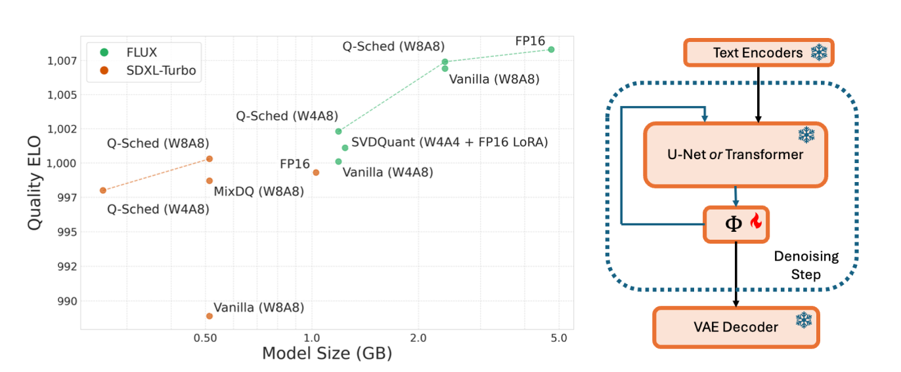

# Pushing the Boundaries of Few-Step Diffusion Models with Quantization-Aware Scheduling

[[paper](https://arxiv.org/abs/2509.01624)]



## TL; DR

A training-free scheduler adaptation for quantized diffusion models. Use an off-the-shelf pre-trained model and adapt it's scheduler for faster inference.

## News

- [2025-09-01] 🔥 Q-Sched is publicly released!

## Abstract

Text-to-image diffusion models are computationally intensive, often requiring dozens of forward passes through large transformer backbones. For instance, Stable Diffusion XL generates high-quality images with 50 evaluations of a 2.6B-parameter model, an expensive process even for a single batch. Few-step diffusion models reduce this cost to 2-8 denoising steps but still depend on large, uncompressed U-Net or diffusion transformer backbones, which are often too costly for full-precision inference without datacenter GPUs. These requirements also limit existing post-training quantization methods that rely on full-precision calibration.
We introduce Q-Sched, a new paradigm for post-training quantization that modifies the diffusion model scheduler rather than model weights. By adjusting the few-step sampling trajectory, Q-Sched achieves full-precision accuracy with a 4x reduction in model size. To learn quantization-aware pre-conditioning coefficients, we propose the JAQ loss, which combines text-image compatibility with an image quality metric for fine-grained optimization. JAQ is reference-free and requires only a handful of calibration prompts, avoiding full-precision inference during calibration.
Q-Sched delivers substantial gains: a 15.5% FID improvement over the FP16 4-step Latent Consistency Model and a 16.6% improvement over the FP16 8-step Phased Consistency Model, showing that quantization and few-step distillation are complementary for high-fidelity generation. A large-scale user study with more than 80,000 annotations further confirms Q-Sched’s effectiveness on both FLUX.1[schnell] and SDXL-Turbo. Code will be released upon publication.

## Usage

### Environment Setup

Our current environment is compatible with Nvidia RTX A6000s with CUDA 12.2, driver version 535.230.02. 

```bash
conda env create -f env.yml
```

Download the [sDCI](https://huggingface.co/datasets/mit-han-lab/svdquant-datasets/blob/35636da44cdc7cef8916b122a12e4aa9e2df80c1/sDCI.yaml) .yaml file to use as a calibration dataset. Name it as `q-sched/dci_prompts.yaml`.

### Q-Sched Search & Evaluation

See scripts folder. First, find new coefficients using `source scripts/qsched.sh` and generate images with the new schedule using `source scripts/collect_images.sh`.
